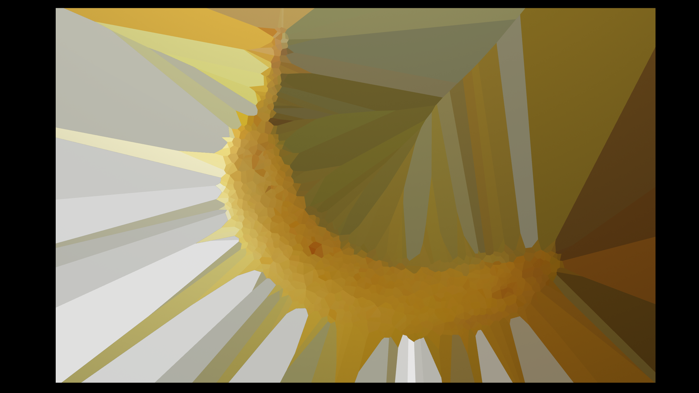
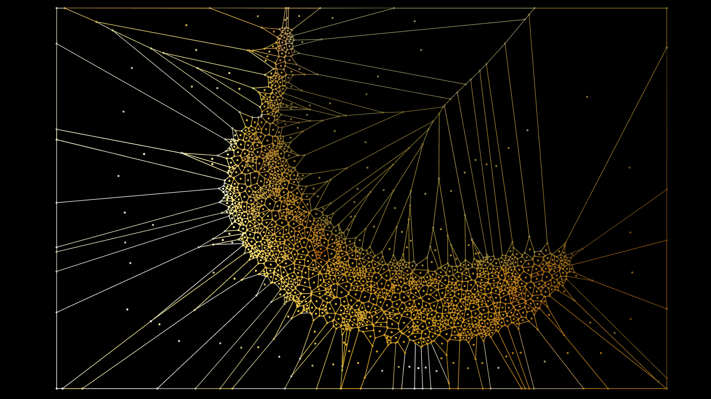
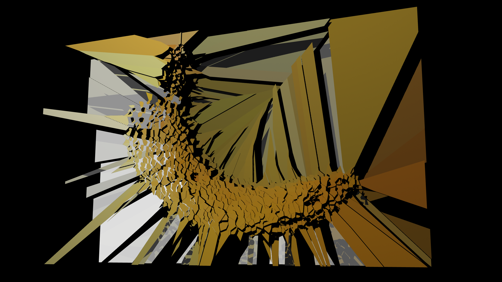
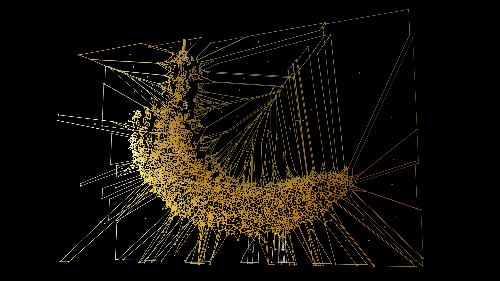
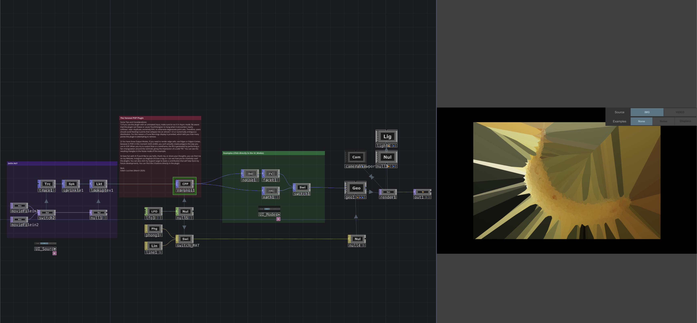

# Voronoi-POP
POP Operator for generating **2D Voronoi diagrams** as polygonal cells (line strips and/or triangle fills) from a point input.

## What It Does

- Reads points from the input POP's `P` attribute
- Projects points onto the `XY`, `YZ`, or `ZX` plane
- Apply bounds to the cell generation in Auto and Manual mode
- Generates Voronoi diagrams reliably, even with degenerate inputs in 3 output modes (Line strips, triangle fills and Line strips + point primitive)
- Supports both `Sync` and `Async` modes through the `Async` toggle
  - `Async` mode is recommended for animated or continuously changing inputs because it allows non-blocking computation
  - For static inputs, `Sync` mode is recommended to ensure immediate and deterministic results
- Passes point attributes through to the output like a standard POP operator

## Libraries Used

- TouchDesigner POP C++ API
- 

## Requirements
- Touchdesigner 2025+ (This plugin was tested in 2025.32460)

## How to Download this Repo
On Mac, if you download the .plugin file as a zip or zip it yourself, this removes the momentary signature.
I suggest you simply clone it directly from the GitHub repository using the git clone command in your system terminal in a folder of your choice to avoid this problem.

The "Git Clone" procedure for those who don't know how to do it:

- Click on Code on the repository and copy the url

- Open your terminal in a folder you wish and digit 'git clone theUrlYouCopiedBefore'

## Installation

- Copy the plugin into your project and load it through the `CPlusPlus POP` operator, as shown in the examples provided in `Delaunay Example/MAC` or `Delaunay Example/WINDOWS`
- Alternatively, install it directly in TouchDesigner like any other Custom OP so that it becomes available from the **Custom** panel in the **OP Create Dialog**

Custom OPs can be installed by placing the plugin in the correct location on disk. TouchDesigner will detect it automatically at startup.

- On Windows, a plugin is a `.dll` file, possibly accompanied by additional files
- On macOS, a plugin is a `.plugin` folder

### Plugin Locations

#### Windows

`Documents/Derivative/Plugins`

Typical path:

`C:/Users/<username>/Documents/Derivative/Plugins`

#### macOS

`/Users/<username>/Library/Application Support/Derivative/TouchDesigner099/Plugins`

## Distribution

- Plugin format: `.plugin` (macOS bundle), `.dll` (Windows)
- Operator name: `Voronoi`
- Version: `1.0`
- License: `MIT`
- Author: [Edwin Lucchesi](https://www.edwinlucchesi.com/)

## Possible Issues
The Voronoi plugin can become unstable with nearly collinear, near-duplicate, extremely thin, or otherwise degenerate point sets,
so users should avoid feeding it points that collapse to an almost 1D or numerically ambiguous distribution.
If that happens, you'll see stalling or a freeze in the plugin or TD itself.
A trick is to use a slight random offset to the input points.
In the example, the sprinkle POP already does the job, but if you use some Particles POP or other organic movements, keep this in mind.
For that, I’ve added a “Prune Warning” button to allow checking if the input contains points that could cause this stall.

## Share Your Results

If you use this plugin, feel free to tag me.
I'll be happy to see your results!

Instagram: [@Alaghast](https://www.instagram.com/alaghast/)

Want support me and this project? [Click Here!](https://ko-fi.com/alaghast)
Want follow some of my future updates? [Click Here!](https://www.patreon.com//Alaghast)

2025-26
